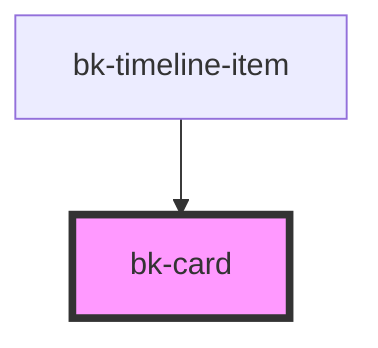

# bk-card

Integrate information in a card container.

```javascript
import { html } from 'lit-html'

html`
    <bk-card shadow="never">
        <div slot="header">
            Card Heading
        </div>
        <div slot="body">
            Lorem ipsum dolor sit amet, consectetur adipiscing elit, sed do eiusmod tempor incididunt ut labore et
            dolore magna aliqua. Ut enim ad minim veniam, quis nostrud exercitation ullamco laboris nisi ut aliquip ex
            ea commodo consequat. Duis aute irure dolor in reprehenderit in voluptate velit esse cillum dolore eu fugiat
            nulla pariatur. Excepteur sint occaecat cupidatat non proident, sunt in culpa qui officia deserunt mollit
            anim id est laborum.
        </div>
    </bk-card>
`
```

&nbsp;

<!-- Auto Generated Below -->


## Properties

| Property | Attribute | Description                 | Type                             | Default   |
| -------- | --------- | --------------------------- | -------------------------------- | --------- |
| `shadow` | `shadow`  | Set shadow of the component | `"always" \| "hover" \| "never"` | `'never'` |


## Slots

| Slot       | Description                         |
| ---------- | ----------------------------------- |
| `"body"`   | Use this to render the card body.   |
| `"header"` | Use this to render the card header. |


## Dependencies

### Used by

 - [bk-timeline-item](../Timeline/TimelineItem)

### Graph


----------------------------------------------


