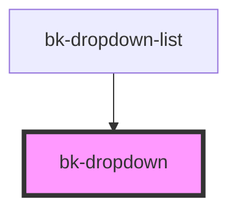

# bk-dropdown

```javascript
import { html } from 'lit-html'

const onOpened = () => {}

const onClosed = () => {}

html`
    <bk-dropdown
        open="false"
        click-outside-to-close="true"
        disabled="false"
        @bkOpened=${onOpened}
        @bkClosed=${onClosed}
    >
        <button class="bk-button" slot="control">Click me</button>
        <div slot="content">Hello world</div>
    </bk-dropdown>
`
```

&nbsp;

<!-- Auto Generated Below -->


## Properties

| Property              | Attribute                | Description                         | Type      | Default |
| --------------------- | ------------------------ | ----------------------------------- | --------- | ------- |
| `clickOutsideToClose` | `click-outside-to-close` | Close the menu when clicked outside | `boolean` | `true`  |
| `disabled`            | `disabled`               | Enable or disable the dropdown      | `boolean` | `false` |
| `open`                | `open`                   | Open or close the menu              | `boolean` | `false` |


## Events

| Event      | Description          | Type               |
| ---------- | -------------------- | ------------------ |
| `bkClosed` | Fired when destroyed | `CustomEvent<any>` |
| `bkOpened` | Fired when opened    | `CustomEvent<any>` |


## Slots

| Slot        | Description              |
| ----------- | ------------------------ |
| `"content"` | The content of the menu. |
| `"control"` | Controlling element.     |


## Dependencies

### Used by

 - [bk-dropdown-list](../DropdownList)

### Graph


----------------------------------------------


