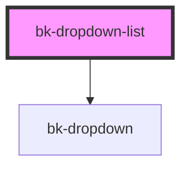

# bk-dropdown-list

### Option interface

```javascript
interface Option {
    label: string
    value: string
    disabled?: boolean
}

```

### Basic usage

```javascript
import { html } from 'lit-html'

const option: Option[] = [
    {
        label: 'Apple',
        value: '1',
        disabled: true,
    },
    {
        label: 'Orange',
        value: '2',
    },
]

html`<bk-dropdown-list
    disabled="false"
    searchable="false"
    options=${JSON.stringify(options)}
    selected-option=${options[1].value}
    @bkSelect=${(e: CustomEvent) => console.log(e.detail)}
>
    <button class="bk-button" slot="control">
        Click me
    </button>
</bk-dropdown-list>`
```

### Advanced usage

```javascript
import { html } from 'lit-html'

const onOptionSelect = (e: CustomEvent) => {
    const button = document.getElementById('control')
    button.textContent = `Selected Option: ${e.detail.label}`
}

html`<bk-dropdown-list
    disabled="false"
    searchable="false"
    options=${JSON.stringify(options)}
    @bkSelect=${onOptionSelect}
>
    <button id="control" class="bk-button bk-button--text" slot="control">
        Select an option
    </button>
</bk-dropdown-list>`
```

&nbsp;

<!-- Auto Generated Below -->


## Properties

| Property         | Attribute         | Description                                               | Type                  | Default        |
| ---------------- | ----------------- | --------------------------------------------------------- | --------------------- | -------------- |
| `disabled`       | `disabled`        | Disable DropdownList                                      | `boolean`             | `false`        |
| `noOptionText`   | `no-option-text`  | Text to show when no options available                    | `string`              | `'No options'` |
| `options`        | `options`         | Pass stringified object when used with vanilla Javascript | `Option[] \| string`  | `[]`           |
| `searchable`     | `searchable`      | With search                                               | `boolean`             | `false`        |
| `selectedOption` | `selected-option` | Set selected option                                       | `string \| undefined` | `undefined`    |


## Events

| Event      | Description               | Type                  |
| ---------- | ------------------------- | --------------------- |
| `bkSelect` | Fired on selecting option | `CustomEvent<Option>` |


## Dependencies

### Depends on

- [bk-dropdown](../Dropdown)

### Graph


----------------------------------------------


