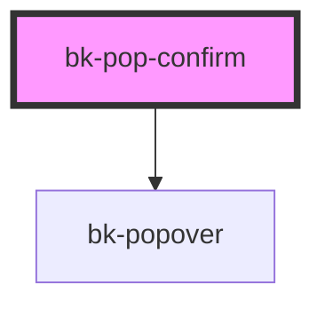

# bk-popconfirm

```javascript
import { html } from 'lit-html'

const onConfirmed = () => {}

const onCancelled = () => {}

html`
    <bk-pop-confirm
        confirm-button-text="Confirm"
        cancel-button-text="Cancel"
        confirm-button-variant="primary"
        cancel-button-variant="default"
        message="Are you sure, you want to delete this?"
        disabled="false"
        @bkConfirmed=${onConfirmed}
        @bkCancelled=${onCancelled}
    >
        <button class="bk-button">Delete</button>
    </bk-pop-confirm>
`
```

&nbsp;

<!-- Auto Generated Below -->


## Properties

| Property               | Attribute                | Description               | Type                                                                               | Default     |
| ---------------------- | ------------------------ | ------------------------- | ---------------------------------------------------------------------------------- | ----------- |
| `cancelButtonText`     | `cancel-button-text`     | Cancel button text        | `string`                                                                           | `'Cancel'`  |
| `cancelButtonVariant`  | `cancel-button-variant`  | Cancel button variant     | `"danger" \| "default" \| "info" \| "primary" \| "success" \| "text" \| "warning"` | `'default'` |
| `confirmButtonText`    | `confirm-button-text`    | Confirm button text       | `string`                                                                           | `'Confirm'` |
| `confirmButtonVariant` | `confirm-button-variant` | Confirm button variant    | `"danger" \| "default" \| "info" \| "primary" \| "success" \| "text" \| "warning"` | `'primary'` |
| `disabled`             | `disabled`               | Enable or disable popover | `boolean`                                                                          | `false`     |
| `message`              | `message`                | Message to show           | `string \| undefined`                                                              | `undefined` |


## Events

| Event         | Description       | Type               |
| ------------- | ----------------- | ------------------ |
| `bkCancelled` | on cancel action  | `CustomEvent<any>` |
| `bkConfirmed` | on confirm action | `CustomEvent<any>` |


## Slots

| Slot | Description                  |
| ---- | ---------------------------- |
|      | Triggering control goes here |


## Dependencies

### Depends on

- [bk-popover](../Popover)

### Graph


----------------------------------------------


