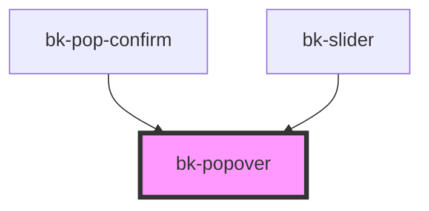

# bk-popover

```javascript
import { html } from 'lit-html'

const onOpened = () => {}

const onClosed = () => {}

html`
    <bk-popover trigger-on="click" placement="auto" disabled="true" @bkOpened=${onOpened} @bkClosed=${onClosed}>
        <button class="bk-button" slot="control">Popover</button>
        <div slot="content">This is the content of the popover</div>
    </bk-popover>
`
```

&nbsp;

<!-- Auto Generated Below -->


## Properties

| Property    | Attribute    | Description                    | Type                                                                                                                                                                                                         | Default   |
| ----------- | ------------ | ------------------------------ | ------------------------------------------------------------------------------------------------------------------------------------------------------------------------------------------------------------ | --------- |
| `disabled`  | `disabled`   | Enable or disable popover      | `boolean`                                                                                                                                                                                                    | `false`   |
| `placement` | `placement`  | This will set the trigger even | `"auto" \| "auto-end" \| "auto-start" \| "bottom" \| "bottom-end" \| "bottom-start" \| "left" \| "left-end" \| "left-start" \| "right" \| "right-end" \| "right-start" \| "top" \| "top-end" \| "top-start"` | `'auto'`  |
| `show`      | `show`       | show or hide the popover.      | `boolean`                                                                                                                                                                                                    | `false`   |
| `triggerOn` | `trigger-on` | This will set the trigger even | `"click" \| "focus" \| "hover" \| "manual"`                                                                                                                                                                  | `'click'` |


## Events

| Event      | Description          | Type               |
| ---------- | -------------------- | ------------------ |
| `bkClosed` | Fired when destroyed | `CustomEvent<any>` |
| `bkOpened` | Fired when opened    | `CustomEvent<any>` |


## Slots

| Slot        | Description                                    |
| ----------- | ---------------------------------------------- |
| `"content"` | The content of the popover.                    |
| `"control"` | The element on which the popover should apply. |


## Dependencies

### Used by

 - [bk-pop-confirm](../PopConfirm)
 - [bk-slider](../Slider)

### Graph


----------------------------------------------


