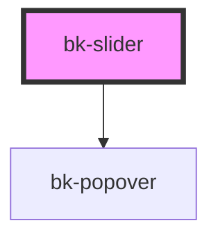

# bk-slider

<!-- Auto Generated Below -->

## Properties

| Property      | Attribute      | Description                    | Type                                                        | Default     |
| ------------- | -------------- | ------------------------------ | ----------------------------------------------------------- | ----------- |
| `disabled`    | `disabled`     | Enable or disable slider       | `boolean`                                                   | `false`     |
| `showTooltip` | `show-tooltip` | Show or hide the tooltip       | `boolean`                                                   | `true`      |
| `step`        | `step`         | Set the stepper for the slider | `number`                                                    | `1`         |
| `value`       | `value`        | Set value                      | `number`                                                    | `0`         |
| `variant`     | `variant`      | Type of the slider             | `"danger" \| "default" \| "info" \| "success" \| "warning"` | `'default'` |

## Events

| Event      | Description              | Type               |
| ---------- | ------------------------ | ------------------ |
| `bkChange` | Fired when value changed | `CustomEvent<any>` |

## Dependencies

### Depends on

- [bk-popover](../Popover)

### Graph

----------------------------------------------

