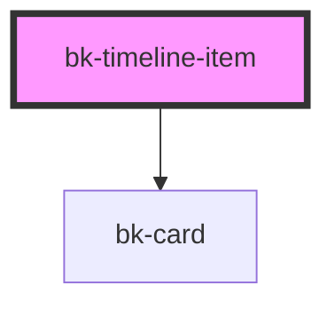

# bk-timeline-item

Single time line item

```javascript
import { html } from 'lit-html'

html`
    <bk-timeline-item time="01-01-2020 19:20" variant="success">
        <h4>Update Github template</h4>
        <p>Tom committed 01-01-2020 19:20</p>
    </bk-timeline-item>
`
```

&nbsp;

<!-- Auto Generated Below -->


## Properties

| Property            | Attribute | Description          | Type                                                        | Default     |
| ------------------- | --------- | -------------------- | ----------------------------------------------------------- | ----------- |
| `time` _(required)_ | `time`    | Time to be displayed | `string`                                                    | `undefined` |
| `variant`           | `variant` | The variant of node  | `"danger" \| "default" \| "info" \| "success" \| "warning"` | `'default'` |


## Dependencies

### Depends on

- [bk-card](../../Card)

### Graph


----------------------------------------------


